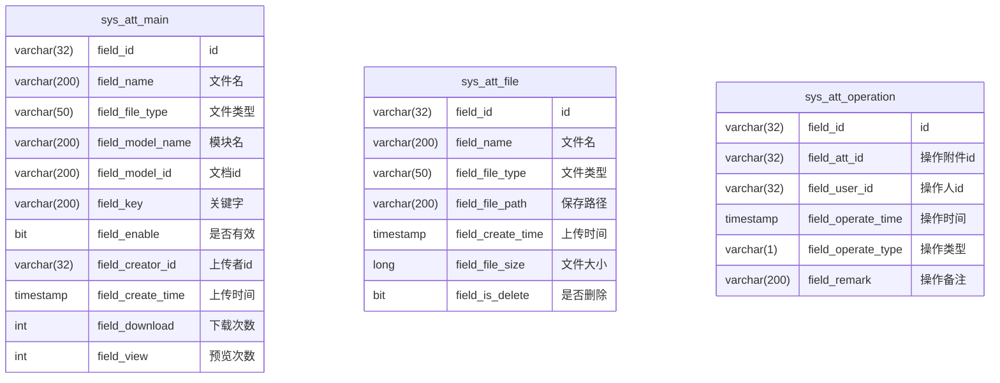
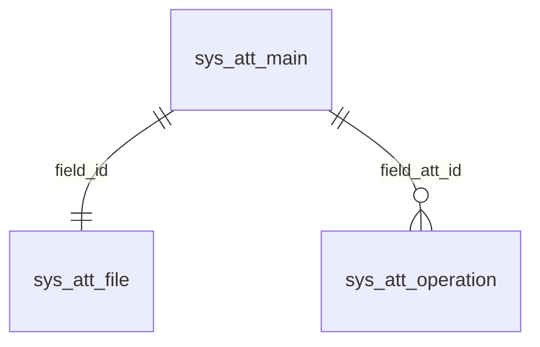

# 附件表结构

## 附件表字段

```mermaid
erDiagram
    sys_att_main {
        varchar(32) field_id "id"
        varchar(200) field_name "文件名"
        varchar(50) field_file_type "文件类型"
        varchar(200) field_model_name "模块名"
        varchar(200) field_model_id "文档id"
        varchar(200) field_key "关键字"
        bit field_enable "是否有效"
        varchar(32) field_creator_id "上传者id"
        timestamp field_create_time "上传时间"
        int field_download "下载次数"
        int field_view "预览次数"
    }
    
    sys_att_file {
        varchar(32) field_id "id"
        varchar(200) field_name "文件名"
        varchar(50) field_file_type "文件类型"
        varchar(200) field_file_path "保存路径"
        timestamp field_create_time "上传时间"
        long field_file_size "文件大小"
        bit field_is_delete "是否删除"
    }
    
    sys_att_operation {
        varchar(32) field_id "id"
        varchar(32) field_att_id "操作附件id"
        varchar(32) field_user_id "操作人id"
        timestamp field_operate_time "操作时间"
        varchar(1) field_operate_type "操作类型"
        varchar(200) field_remark "操作备注"
    }
```

## 附件表关系

```mermaid
erDiagram
    sys_att_main ||--|| sys_att_file : "field_id"
    sys_att_main ||--o{ sys_att_operation : "field_att_id"
```

## 枚举值

sys_att_operation.field_operate_type

| 枚举值  | 实际值 |
|------|-----|
| 上传   | 1   |
| 修改   | 2   |
| 删除   | 3   |
| 后台删除 | 4   |
| 下载   | 5   |
| 浏览   | 6   |
