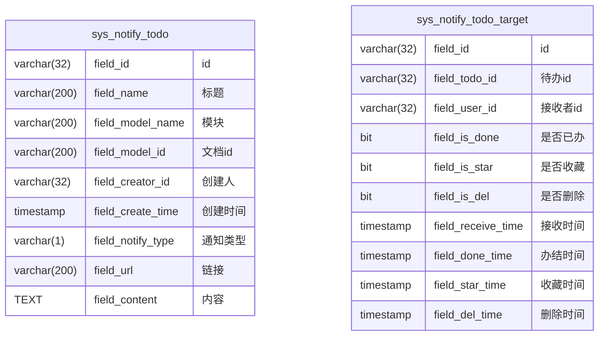
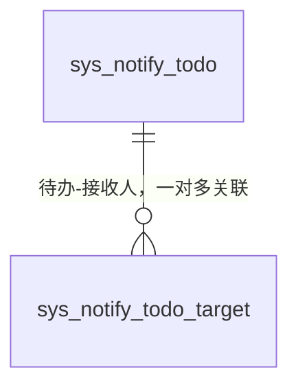

# 待办表结构

## 表字段

```mermaid
erDiagram
    sys_notify_todo{
        varchar(32) field_id "id"
        varchar(200) field_name "标题"
        varchar(200) field_model_name "模块"
        varchar(200) field_model_id "文档id"
        varchar(32) field_creator_id "创建人"
        timestamp field_create_time "创建时间"
        varchar(1) field_notify_type "通知类型"
        varchar(200) field_url "链接"
        TEXT field_content "内容"
    }
    
    sys_notify_todo_target{
        varchar(32) field_id "id"
        varchar(32) field_todo_id "待办id"
        varchar(32) field_user_id "接收者id"
        bit field_is_done "是否已办"
        bit field_is_star "是否收藏"
        bit field_is_del "是否删除"
        timestamp field_receive_time "接收时间"
        timestamp field_done_time "办结时间"
        timestamp field_star_time "收藏时间"
        timestamp field_del_time "删除时间"
    }
```

## 表结构

```mermaid
erDiagram
    sys_notify_todo ||--o{ sys_notify_todo_target : "待办-接收人，一对多关联"
```

## 枚举值

sys_notify_todo.field_notify_type

| 保存值 | 实际值 |
| --- |-----|
| 1 | 待办  |
| 2 | 待阅  |